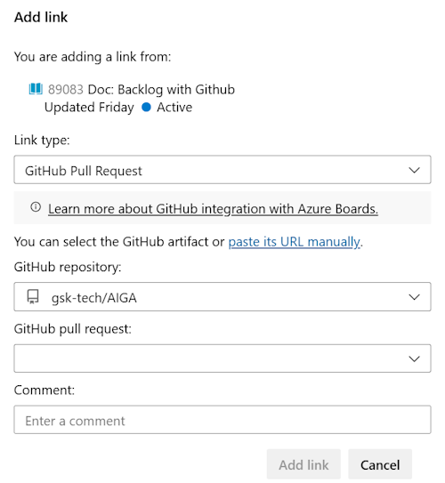

# AzDO Backlog integration with Github Repo

In order to maintain **full traceability** for the AIGA project, it is recommended to integrate Azure Devops, where the backlog is maintained in Azure Boards with Github Enterprise being used primarly to maintain Git repos.

The goal is to maintain the backlog Work Items with respective Git **commits** and **pull requests**.

Once you connect your Azure Boards project with a GitHub repository, you can link work items to your GitHub commits and pull requests.

## In AIGA

The integration will be done connecting User Stories to Github pull requests. The team once assigned to a given User Story, should the elected branch strategy, and start implementation. The expectation is that several commits will happen during implementation, culminating in a pull request, to wrap the user story. Some expected guidance:

- All User Stories (US) should be linked to a Github pull request, once it gets reviewed and merged.
- Additional related Github commits or Github pull requests may be added to a given User Story
- The team may use `#-mention` in commits or pull requests to link it to AzDO and/or transition work item.

> 📢We are asking all team members to take a look at their [User Stories](https://dev.azure.com/DevOps-Vx/AIGA/_backlogs/backlog/AIGA%20Team/Stories) and **link any past related PRs** and/or commits.

## Action items / Quick guidelines for development

- **Linking an AzDo User Story to Git pull request or commit:**
  - In a given User Story in AzDO, the section `Development` allows to add a GitHub commit or GitHub pull request link type
  - This is done from the Azure Boards work item (e.g. User Story).

    {: style="width:400px"}

- **Linking to an AzDo User Story from Git:**
  - Use `AB#` to link from GitHub to Azure Boards work items: From a GitHub commit, pull request use this convention to create a link to your Azure Boards work item.
  - Enter the `AB#ID` within the text of a commit message. Or, for a pull request, enter the `AB#ID` within the title or description (not a comment).
  - For example, `AB#89083` links to work item ID 89083.
  - Linking a commit or pull request will not transition the work item, just linking both.

- **Transition the AzDO work item (e.g. User Story):**
  - Use a commit or pull request message to transition the work item.
  - The system recognizes `fix, fixes, fixed` and applies it to the #-mention item that follows.
  - Mentioned work items transition to a state of *Resolved* (depending on the workflow process configured).

Some examples:

| Commit or pull request message | Action |
| --- | --- |
| `Fixed AB#89083` | **Links and transitions** the work item to the *Resolved* workflow state. |
| `Adds a new feature, fixes AB#89083.` | **Links and transitions** the work item to the *Resolved* workflow state. |
| `Fixes AB#89083, AB#88126, and AB#88141` | **Links** to Azure Boards work items 89083, 88126, and 88141. **Transitions only the first item**, 89083 to the *Resolved* workflow state.|
| `Fixes AB#89083, Fixes AB#88126, Fixes AB#88141` | **Links** to Azure Boards work items 89083, 88126, and 88141. **Transitions all items** to the *Resolved* workflow state. |

## Conclusion

The team will use minimum integration to allow traceability on main implementations merged to the project repo. During the sprints, specifically in stand-ups, the team can view GitHub annotations on cards within a board. Everyone can quickly open linked GitHub commits or pull requests for more detail.

## Related articles

Github and Azure Boards integration brings additional capabilities. In order to explore further information consider following references:

- [Link GitHub commits and pull requests to work items in Azure Boards](https://learn.microsoft.com/en-us/azure/devops/boards/github/link-to-from-github?view=azure-devops)
- [Azure Boards-GitHub integration](https://learn.microsoft.com/en-us/azure/devops/boards/github/?view=azure-devops)
- [How workflow category states are used in Azure Boards backlogs and boards](https://learn.microsoft.com/en-us/azure/devops/boards/work-items/workflow-and-state-categories?view=azure-devops)
- [Link work items to objects](https://learn.microsoft.com/en-us/azure/devops/boards/backlogs/add-link?view=azure-devops)
- [About workflow states in backlogs and boards](https://learn.microsoft.com/en-us/azure/devops/boards/work-items/workflow-and-state-categories?view=azure-devops&tabs=agile-process)
- [Troubleshoot GitHub & Azure Boards integration](https://learn.microsoft.com/en-us/azure/devops/boards/github/troubleshoot-github-connection?view=azure-devops)
