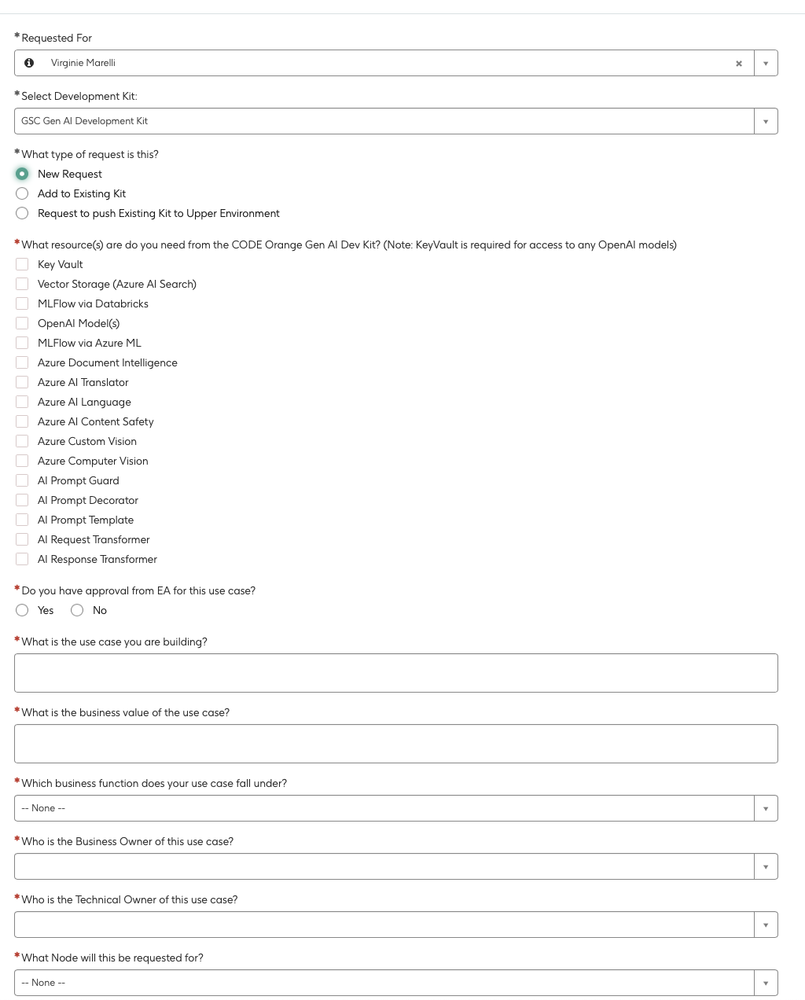

# Getting Started

If you are looking to start a new Generative AI project, you should consider using the AIGA Starter. If you are looking to find out more about the benefits of using AIGA, check out the [README.md](../README.md).

This guide contains the steps to set up a new project using the AIGA Starter and explains the artefacts that are generated by the template.

## Prerequisites

Before you start working with AIGA, ensure you have:
Before you start working with AIGA, ensure you have:

| Entity | System (to request) | Description | Assignment Group | Required for |
| -------- | ---- | ----------- | ---------- | ---------- |
| Business Application CIID | [CMDB](https://gsk.service-now.com/home?id=sc_cat_item&table=sc_cat_item&sys_id=fb257b2b1b7a7d104ab887b8e34bcb95) | In order to create a new instance of AIGA, you need a business application CIID. This will be the umbrella for the application service CIID. This CIID will allow you to track the costs, to associate all the relevant infrastructure services and also to maintain and support your application. It is required through the E2E lifecycle of the project. | ESM-Platform-CMDB-L2  | Infrastructure request |
| Application service CIID | [CMDB](https://gsk.service-now.com/home?id=sc_cat_item&table=sc_cat_item&sys_id=a02468771bbb31904ab887b8e34bcb3a) | For each environment, you need an instance of an application service that is operational. | ESM-Platform-CMDB-L2 | Resource Group Creation, Infrastructure request |
| Resource Group + Service principal | [Hosting portal](https://myhosting.gsk.com/cloud-onboarding/azure-resource-groups/overview) | In order to have the service principal and resources associated with the project (outside the DevKit), you need to request a resource group on Azure and a service principal. The Resource group is provisioned with the key vault and the service principal. These 2 things are required for the AIGA starter to create an AIGA project from the AIGA template. | | Infrastructure request, AIGA starter |
| AD Group | [Sailpoint](https://myapps.gsk.com/identityiq/workitem/workItems.jsf#/workItems) | In order to give access to the developers access to the infrastructure, you need an AD group RW for dev. Make sure that you create a ticket to link the AD group to the RG by requesting a [Tech Service](https://servicenow.gsk.com/home?id=sc_cat_item&sys_id=0e6a06bcdb5ce4506233d25cd3961932) assigned to *SCDT - DA Platform Product Support Service*. In the description request *RG reader* and *Key vault contributor*| | Infrastructure request |
| AIGA Users team | [GitHub](https://github.com/orgs/gsk-tech/teams/aiga-users) | In order to be able to work with the AIGA Starter (i.e. trigger the Start AIGA Project Action) you would need to be in the gsk-tech GitHub team AIGA Users that is authorised to the repository.| | AIGA Starter |

## Steps to set up a new project

1. **Request to be added to the AIGA Users team**: Go to the [GitHub team](https://github.com/orgs/gsk-tech/teams/aiga-users) and request to be added to the team by selecting the "Request to join" button. This will allow you to trigger the "Create AIGA Project" workflow in the AIGA Starter repository.

1. **Request a new project**: Go to GitHub Actions of [AIGA-starter](https://github.com/gsk-tech/AIGA-Starter) and run the "Create AIGA Project" workflow with chosen parameters (you need a service principal and a key vault). This will create a new repository and infrastructure artefacts based on the AIGA reference architecture. AIGA gets all its environment variables from the key vault.

1. **Submit ARB1**: Fill in the accountability report. In order to be compliant, you need to fill the accountability report and get it approved, before starting an AI project. Check out our [tips](/docs/design/ai-evaluation.md) on how to fill in the accountability report.

1. **Submit infrastructure requests**: Verify the Excel infrastructure request forms and submit them within the GenAI Dev Kit request form and via a [Tech service request](https://servicenow.gsk.com/home?id=sc_cat_item&sys_id=0e6a06bcdb5ce4506233d25cd3961932) for the PSC team  assigned to *SCDT - DA Platform Product Support Service*. Use the [template](/docs/design/assets/Infrastructure%20Request%20Form%20AIGA%20v0.1.xlsx) and only update the yellow boxes with your AD group and service principal.

1. **Approval from EA**: You need [approval from EA](https://myconnect.gsk.com/:w:/r/sites/modern-enterprisearchitecture/_layouts/15/Doc.aspx?sourcedoc=%7B8F9134AD-D7BD-4324-A27D-31D0B2F81FC4%7D&file=EA%20Generative%20AI%20Use%20Case%20Process%20&%20Operating%20Model.docx=&action=default&mobileredirect=true) to get started, especially if you have a higher risk or CSI data in your project.

1. **Request a Devkit**: You will need to request a [DevKit](https://servicenow.gsk.com/home?id=sc_cat_item&table=sc_cat_item&sys_id=17c151861bc98254269687b8e34bcb40) to get the part of the resources provisioned (see the architecture pattern for more information on which resources are provisioned through the DevKit). Fill in the information in the Devkit according to your architecture pattern needs.

While filling the devkit, don't forget to add your key vault and service principal.
Attach the following [file](/docs/design/assets/devkit_roles.yaml) to your devkit, that is the system access plan.

The Code orange team will fill in the [secrets and environment variables](/docs/onboarding/github-secrets.md) directly in the keyvault and AIGA is setup to capture them in the CI and CD pipelines automatically.

1. **Submit infrastructure requests**: Verify the Excel infrastructure request forms and submit via a [Tech service request](https://servicenow.gsk.com/home?id=sc_cat_item&sys_id=0e6a06bcdb5ce4506233d25cd3961932) for the PSC team  assigned to *SCDT - DA Platforms--Service*.
   1. *Setup permissions for the infrastructure**:
         [See this page](getting-started.md) to request and set up all required permissions for the
         service principle/managed identity/AD token, so the resources will be able to
         communicate properly.

1. **Set up your AIGA Project**: Configure your AIGA Project repository by following the instructions in the [developer guide](/docs/contributing/developer-guide.md).

1. **Customize your project**: Now you are all set to start working on your project. Once all your infrastructure is setup, you can focus on your project specificities. Check the guide on the [lifecycle of a GenAI project](/docs/design/ai-evaluation.md) to help you.

1. **Evaluate your GenAI application**: Once your repository is fully configured, you can follow the [evaluation user guide](/docs/onboarding/experiment-evaluate-locally.md) to evaluate iteratively your application and refine your flows and pipelines.

1. **Deploy your flows**: Once you are happy with your inference prompt flow's performance, you can deploy it to App Service or Azure Machine Learning (AML) endpoint using the CI/CD workflows provided in the AIGA Project repository. More information on making a decision between App Service and AML can be found in the [deployment guide](./deployment.md).

1. **Deploy your Document processing pipelines**: Once you are happy with your document processing pipelines, you can deploy it to Azure Machine Learning (AML) the CI/CD workflows provided in the AIGA Project repository (*TBD: WHEN READY*).

## The included artefacts

Once you request a new project using the AIGA Starter, the following artefacts will be generated:

- **Infrastructure artefacts based on AIGA [reference architecture](../design/reference-architecture.md)**: A set of infrastructure artefacts including architecture documentation that can be used for ARB1, pre-filled Excel infrastructure request forms, and instructions on how to fill out the GenAI Dev Kit request form.

    > *TBD: will we be able to offer samples of other necessary documentation e.g. URS, smart control assessment, accountability report?*
- **AIGA Project Repository**: A clone of the AIGA Template repository, which will include a document loading AML pipeline, QA generation script, example prompt flows for common use cases for inference and evaluation, tools for deploying your prompt flows (CI/CD) to App Service or Azure Machine Learning (AML) endpoint, and documentation. The pipelines and prompt flows are designed to be modular so that you can easily customise them and experiment with different configurations while also providing an end-to-end path to productionising your Gen AI project.

    The included components are:

    

We also recommend the following artefact for RAG projects that need in depth experimentation on chunking, indexing, and search strategies:

## Personas

The following personas are involved in the AIGA project setup:

1. **Product Manager and Gen AI Engineer**: Use AIGA Reference Architecture to design the product architecture and go through ARB1. Use AIGA Request to request the provisioning of a Code Orange Gen AI Dev Kit and other infrastructure required for the project.

1. **Gen AI Engineer**: Use the AIGA Starter to instantiate a project repository from the AIGA Template.

1. **Data Scientist**: Use the AIGA Project repository (and optionally the RAG Experimentation repository) to experiment, build and industrialise their Gen AI Project.

1. **Product Manager**: Use the project documentation to go through ARB2 during industrialization and supervise MLOps gates into production.

1. **End User**: Use the deployed Gen AI application to evaluate their GenAI application and fine their expectations.

## Roles and Access

The following roles are involved in the AIGA development and usage, as defined in the [AIGA RBAC ADR](../adrs/016-AIGA-RBAC.md):

### Maintainers

Maintainers have full access to their repositories and are able to manage code, actions, and RBAC on their repositories. These include:

- **AIGA Maintainer**: Maintains the AIGA repository.
- **AIGA Starter Maintainer**: Maintains the AIGA-Starter repository.

> Add a maintainer to the repository by adding them to the [AIGA Collaborators list](https://github.com/gsk-tech/AIGA/settings/access) or to [AIGA-Starter Collaborators list](https://github.com/gsk-tech/AIGA-Starter/settings/access) with an admin role.

### Contributors

Contributors have access to their repositories and are able to contribute to the codebase and actions. These include:

- **AIGA Contributor**: Contributes to the AIGA repository.
- **AIGA Starter Contributor**: Contributes to the AIGA-Starter repository.

> Add a contributor to the repository by adding them to the [AIGA Collaborators list](https://github.com/gsk-tech/AIGA/settings/access) or to [AIGA-Starter Collaborators list](https://github.com/gsk-tech/AIGA-Starter/settings/access) with a write role.

### Users

Users can trigger actions and use the AIGA-Starter repository. This includes:

- **AIGA Starter User**: Triggers actions and uses the AIGA-Starter repository.

> Add an AIGA Starter User by adding them to the [AIGA-Users team](https://github.com/orgs/gsk-tech/teams/aiga-users)
