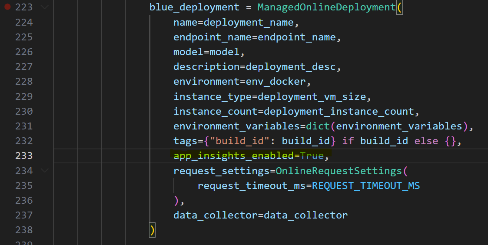
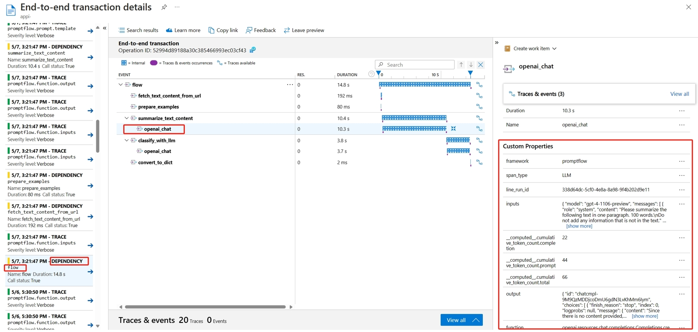

# Observability

## Azure Machine Learning Endpoint

Application Insights resource is provisioned and linked to your Azure Machine Learning (AML) workspace by default. This is where any telemetry data from your inference Prompt Flow runs will be stored.

After you deploy your AML managed endpoint for the first time, you will automatically see traces from your Prompt Flow runs in Application Insights. This has been configured by default in the [provision_deployment.py](https://github.com/gsk-tech/AIGA/tree/main/llmops/common/deployment/provision_deployment.py) script:

Make sure `APPLICATIONINSIGHTS_CONNECTION_STRING` secret is [added to your Azure Key Vault](./github-secrets.md) (the one connected to your GitHub workflow).

### Traces

The tracing data from your Prompt Flow runs will be stored in Application Insights. You can view this data in the Azure portal by navigating to your Application Insights resource, selecting the "Transaction search" tab (under "Investigate") and choosing the relevant time period (e.g. last 24 hours). It will look as below:

If you would like to filter the traces based on the name of the experiment, you can use the 'Dependency Name' filter:

When you click on a specific trace, you can see the details of it and inputs and outputs of each step within the Prompt Flow:

## App Service

If you are using an App Service to deploy your inference endpoint, you can enable Application Insights by setting `APPLICATIONINSIGHTS_CONNECTION_STRING` secret to your App Service configuration.
